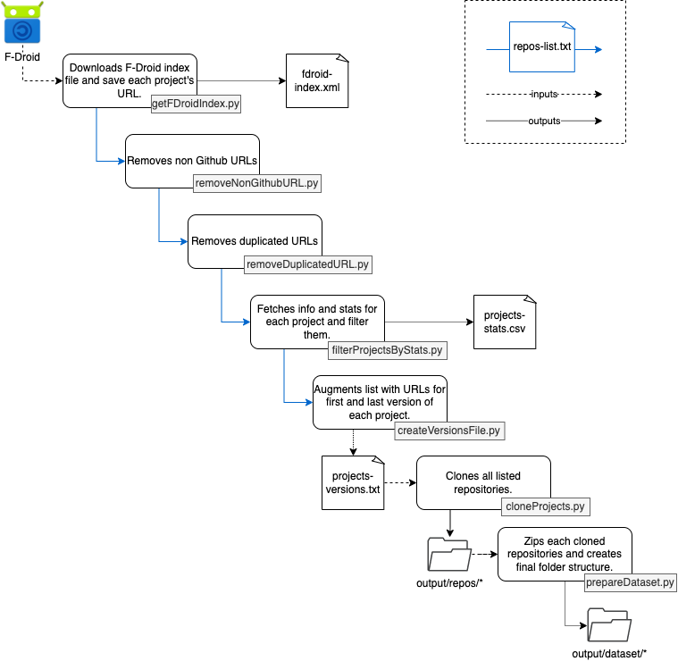

# Collecting data from F-Droid

This collection provides different scripts to manage and clone Android projects.

Currently, only [F-Droid](https://f-droid.org) is supported as an index source for projects.

The available [Makefile](./Makefile) helsp automating some tasks.

- [Collecting data from F-Droid](#collecting-data-from-f-droid)
  - [Installation Requirements](#installation-requirements)
    - [Install Python libraries](#install-python-libraries)
  - [Usage](#usage)
    - [Github Access Key](#github-access-key)
    - [Java and Kotlin projects support](#java-and-kotlin-projects-support)
    - [Pagination (WIP)](#pagination-wip)
    - [Output File Paths](#output-file-paths)
    - [Clean output folder.](#clean-output-folder)
    - [Clone F-Droid projects](#clone-f-droid-projects)

## Installation Requirements

### Install Python libraries

The provided scripts are written in Python, therefore, to install all required libraries (definied in the [requirements.txt](./requirements.txt) file) run the command:
```
make setup
```

## Usage

### Github Access Key

Some scripts make use of Github's APIs/libraries in order to analyse and clone repositories. This way, you may be required to specify your Github account Access Key in an `.env` file such as 
```
GITHUB-ACCESS-TOKEN={your-access-key}
```

### Java and Kotlin projects support

In the `config.env` file you can specify your interest in analyzing/cloning Java and/or Kotlin projects.
```
JAVA-PROJECTS-ANALYSIS = <boolean>
KOTLIN-PROJECTS-ANALYSIS = <boolean>
```
If those variables are not present in the `config.env` file, scripts are going to consider both languages as accepted.

### Pagination (WIP)

Since the execution of scripts that analyse and/or clone Github projects may take a while, you can segment by chunks the projects to analyse/clone by using the pagination variables - offset and limit - in `config.env` file such as
```
FILTER-PAGINATION-OFFSET={insert-number}
FILTER-PAGINATION-OFFSET={insert-number}
```
If those variables are not present in the `config.env` file, the script will analyse/fetch all projects.

### Output File Paths

Many scripts create output files. In general, the location and names for those files are specified in the [filePaths.env](./filePaths.env) file.

### Clean output folder.
To clean all the output files and cloned projects produzed by the scripts, run the command:
```
make clean-output
```

### Clone F-Droid projects

To run the complete flow of filtering and cloning projects from the F-Droid index, run the command:
```
make get-fdroid-index
```



